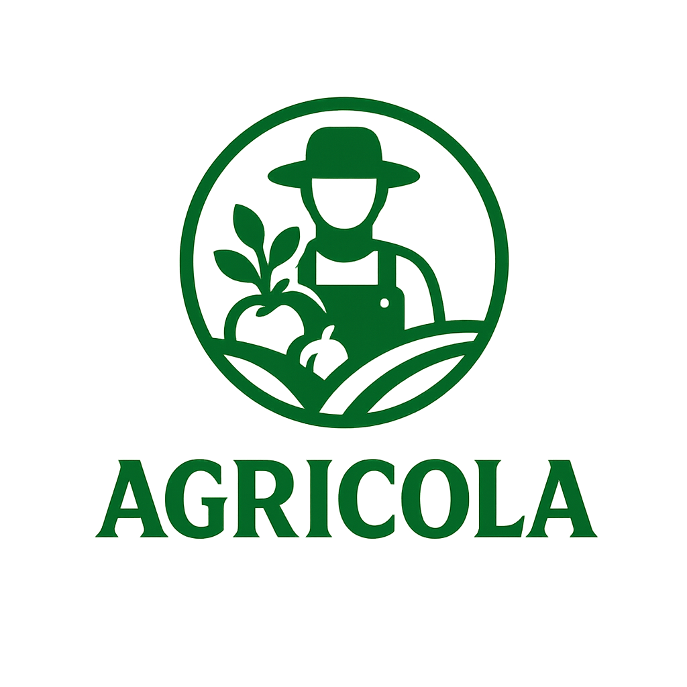
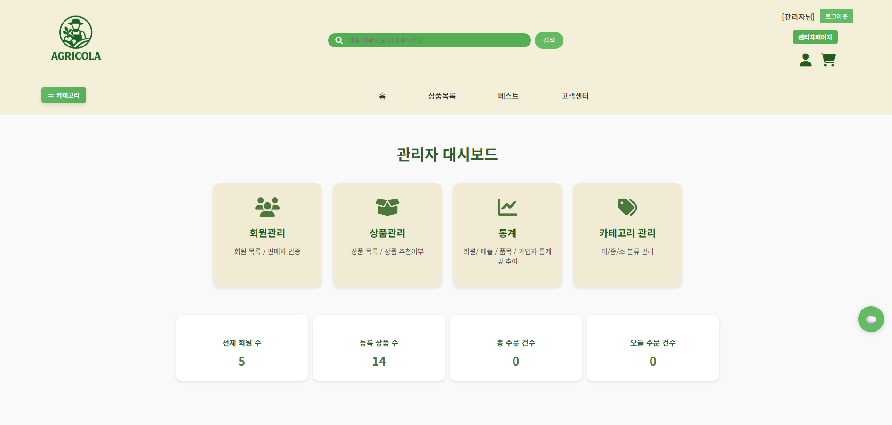
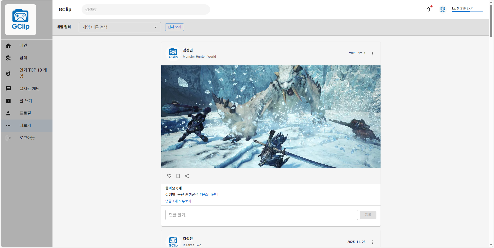
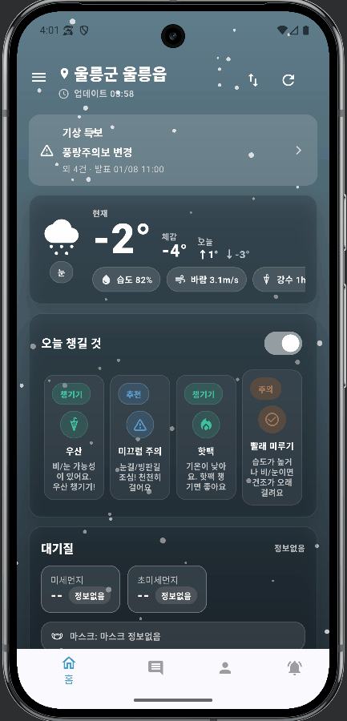

# 김성민 (Kimseongmin) 👋
**Full-stack Developer**  
사용자 흐름을 기준으로 기능을 설계하고, **DB 정합성 → API → UI 연동 → 운영 관점**까지 연결해 “돌아가는 서비스”로 완성하는 개발을 지향합니다.

  
  &nbsp;&nbsp;&nbsp;&nbsp;&nbsp;&nbsp;
  
  &nbsp;&nbsp;&nbsp;&nbsp;&nbsp;&nbsp;
  

<b>Featured Projects</b> · AGRICOLA / GClip / 오늘 어때

---

## 🔥 Highlights
- 사용자 여정(탐색→행동→전환)이 끊기지 않게 **검증 흐름 + 예외 케이스 + 정합성**까지 포함해 설계/구현
- 결제/주문/재고/상태 갱신을 **단일 트랜잭션으로 원자성 보장**, 신뢰 영역(결제)을 안정적으로 처리
- 실시간 기능(socket.io) 구현 및 연결 이슈 해결로 **문제 진단–원인 분리–재발 방지** 경험
- (Flutter) 위치 기반 대시보드(Home)에서 **여러 데이터 소스(Firebase/외부 API)를 안정적으로 결합**하고, 로딩/캐시/예외처리로 UX 완성

---

## 🧰 Tech Stack
**Backend**: Spring Boot · Spring MVC · MyBatis / Node.js(Express) · REST API · JWT  
**Frontend**: React(Router/Context/MUI) · Flutter · JSP · Vue3 · HTML/CSS/JS · AJAX  
**Database**: Oracle · MySQL · Firestore  
**Tools & APIs**: Git/GitHub · Socket.io · PortOne(Iamport) · Kakao Map · RAWG API · Firebase Functions  
**Infra(개인 프로젝트)**: AWS · Nginx · PM2

---

## 🚀 Featured Projects

| Project | Period / Team | What I Built (핵심) | Links |
|---|---|---|---|
| **AGRICOLA** 농수산물 직거래 플랫폼 | 2025.10~2025.11 / 3명(중반 5→3, 팀장) | 판매자 온보딩(검증 흐름) · 내 주변 생산자(탐색 UX) · 결제/정합성 트랜잭션 · 관리자 운영 기능 | [Repo](https://github.com/Kimseongmin3790/Team2_SpringProject.git) · [PPT](https://drive.google.com/file/d/1uDGNjkepO-dKUQeIpOhPxPQ-29l4lkpr/view?usp=drive_link) |
| **GClip** 게임 하이라이트 SNS | 2025.11~2025.12 / 개인 | 피드/검색/랭킹/탐색 흐름 · 실시간 채팅/알림(socket.io) · FK 이슈 해결(삭제/정합성) · RAWG API 연동 | [Repo](https://github.com/Kimseongmin3790/React_Project) |
| **오늘 어때** 날씨 기반 행동 추천 앱 | 2025.12.22~2026.01.08 / 5명 | **메인(Home) 담당**: 현재날씨 · 오늘 챙길 것 · 대기질 · 시간대별/주간 예보 · 즐겨찾기 루트(최소도보/시간/환승) · 내 주변 1km 사건/이슈 | [Team Repo](https://github.com/hyeokjun9035/flutterproject_team2.git) |

---

# 🧩 Project Details

## 1) AGRICOLA — 농수산물 직거래 이커머스 (팀)
**한 줄 요약**: “사용자 경험(탐색/가입) + 운영 검증(승인) + 신뢰(결제/재고 정합성)”을 갖춘 직거래 플랫폼

### 내가 맡은 역할(구체)
- **팀장/조율**
  - 팀원 이탈(5→3) 상황에서 “완주 가능한 핵심 플로우”를 먼저 정의하고, 남은 인력 기준으로 업무 재분배/일정 재설계
  - 원래 담당이 아니었던 **메인 페이지까지 추가 담당**하여 공백을 메우고 완성도 확보
- **판매자 온보딩 플로우(실서비스형)**
  - 사업자등록증 업로드 → 주소→좌표(LAT/LNG) 변환(Kakao Map) → SMS 인증 → 관리자 승인(VERIFIED)
- **메인(내 주변 생산자 탐색 UX)**
  - Vue3로 배너/목록 구성, 반경(1/3/5km) 필터 + 거리 계산 로직 구현
- **결제/주문/재고 정합성**
  - PortOne(Iamport) 연동 후 **imp_uid로 결제 정보 재검증**
  - 주문 생성 → 결제 저장 → 옵션 재고 차감 → 상품 상태 갱신을 **단일 트랜잭션으로 처리**

### 대표 Troubleshooting (STAR)
- **S**: 결제 성공 후 중간 단계 실패 시 주문/재고/상태 데이터 불일치 위험  
- **T**: 결제는 신뢰 영역이라 실패 시에도 정합성 보장 필요  
- **A**: 결제 재검증 + 주문~재고 갱신을 트랜잭션으로 묶어 원자성 확보  
- **R**: 결제/주문 데이터 일관성을 유지하고, 장애 상황에서도 복구/추적이 쉬운 구조를 경험

---

## 2) GClip — 게임 하이라이트 SNS (개인)
**한 줄 요약**: “피드–검색–랭킹–탐색” 흐름과 실시간 상호작용(채팅/알림)을 갖춘 SNS

### 내가 맡은 역할(구체)
- **프론트(React)**
  - React Router/Context로 로그인/유저/알림 상태 관리
  - MUI 기반 카드형 피드, 업로드 모달 등 탐색·업로드 UX 구성
- **백엔드(Node/Express + MySQL)**
  - 게시글/미디어/태그/팔로우/알림/채팅 테이블 설계 및 REST API 구현
  - RAWG API 연동
- **정합성 중심 삭제 로직**
  - FK 이슈를 **연관 테이블 선삭제 + 트랜잭션/논리삭제 전략**으로 해결
- **실시간(socket.io)**
  - 실시간 채팅/알림, connect_error 문제를 .env 분리 + CORS/네트워크 점검으로 안정화

### 대표 Troubleshooting (STAR)
- **S**: 게시글 삭제 시 연관 데이터가 남아 FK 제약으로 실패  
- **T**: 데이터 무결성을 유지하면서 사용자 삭제 경험을 자연스럽게 만들기  
- **A**: 연관 테이블 선삭제 + 트랜잭션 적용(필요 시 논리삭제)  
- **R**: 삭제 실패/데이터 꼬임을 방지하고 정합성을 유지하는 설계 습관을 체득

---

## 3) 오늘 어때 — 날씨 기반 실시간 행동 추천 앱 (팀)
**한 줄 요약**: “현재 날씨 → 오늘 필요한 행동 추천 → 이동/제보 등 실제 행동으로 연결”되는 위치 기반 대시보드 앱

### 내가 맡은 역할(메인 페이지 Home)
- **현재날씨 카드**: 현재/체감, 강수·풍속·습도, 일출/일몰, 최고·최저 표시 + 로딩/예외처리
- **오늘 챙길 것**: 날씨 조건 기반 추천 + 사용자 On/Off(선호 저장 구조)
- **대기질**: PM10/PM2.5 및 등급 표시, 위치 기반 주소 매칭
- **시간대별/주간 예보**: 단기/중기 병합 구조 대응, 지역별 구역 코드 매핑 확장
- **즐겨찾기 루트**: 최소도보/시간/환승 요약 및 선택 유지, 날씨(비/눈) 조건 추천 UX
- **내 주변 1km 사건/이슈**: 최신 3건 요약 + 지도(반경 선택) + 커뮤니티 상세(docId) 연결

### TroubleShooting 키워드
- API 과호출(429) → 재호출 조건 정리 + 캐시/TTL 설계
- 지역별 주간 min/max 누락 → 구역 코드 JSON 매핑 확장
- 탭 이동 후 초기화 → 캐시/상태 복원 전략으로 UX 안정화

---

## 📌 What I Value
- 사용자가 끝까지 완주하는 흐름(UX)을 기준으로 우선순위를 정합니다.
- 예외 상황까지 포함해 **데이터 정합성/트랜잭션/운영 관점**을 함께 고려합니다.
- 협업에서는 근거 기반 정리(README/이슈/설계 메모)로 팀 속도를 높입니다.

---

## 🤝 Contact
- Email: sungmin3790@gmail.com
